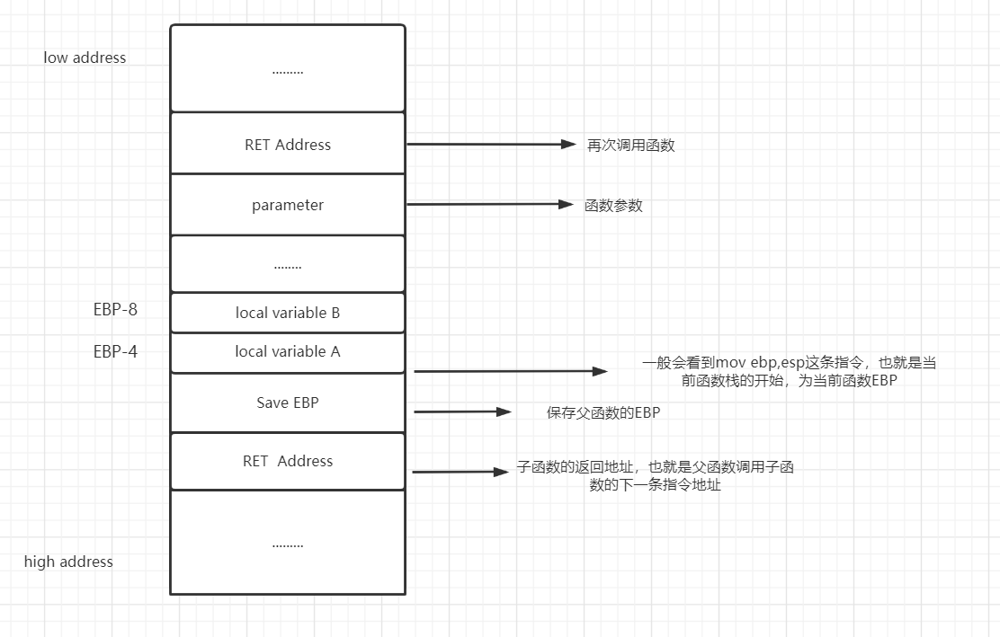
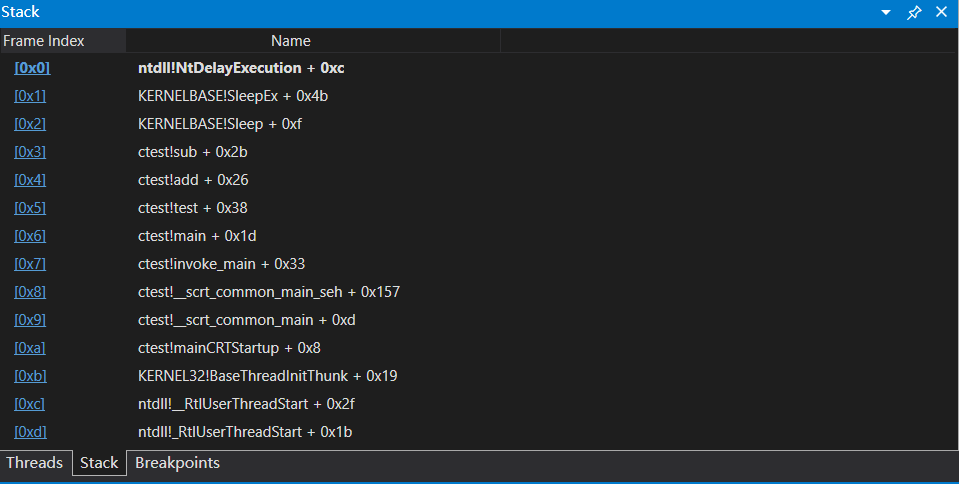
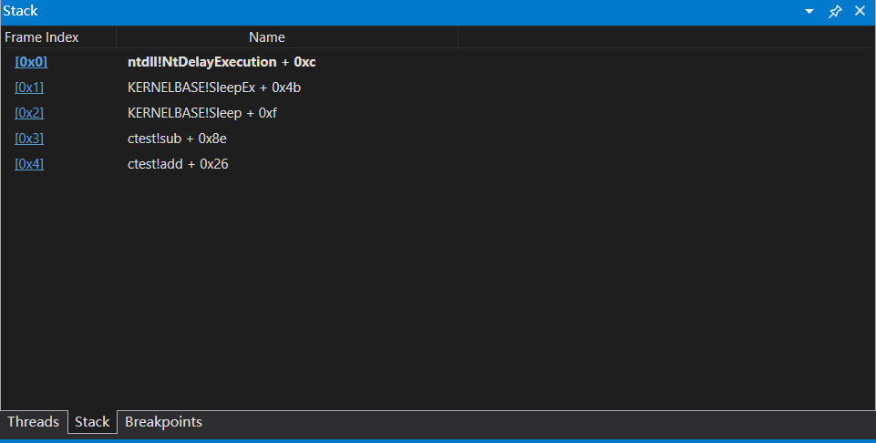
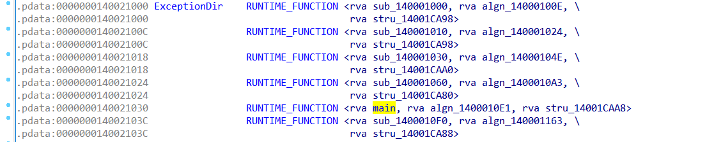
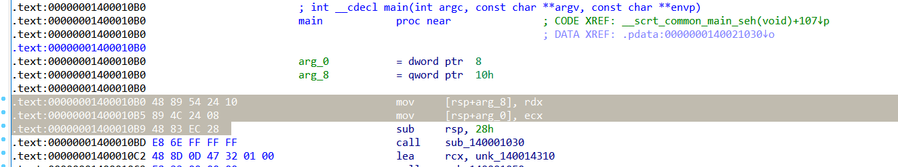
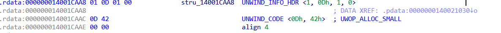
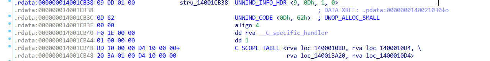
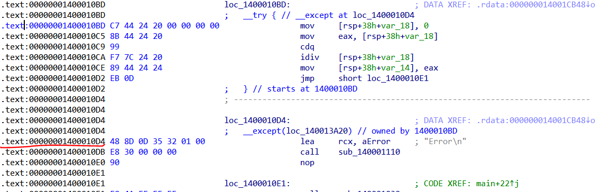
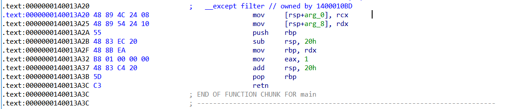
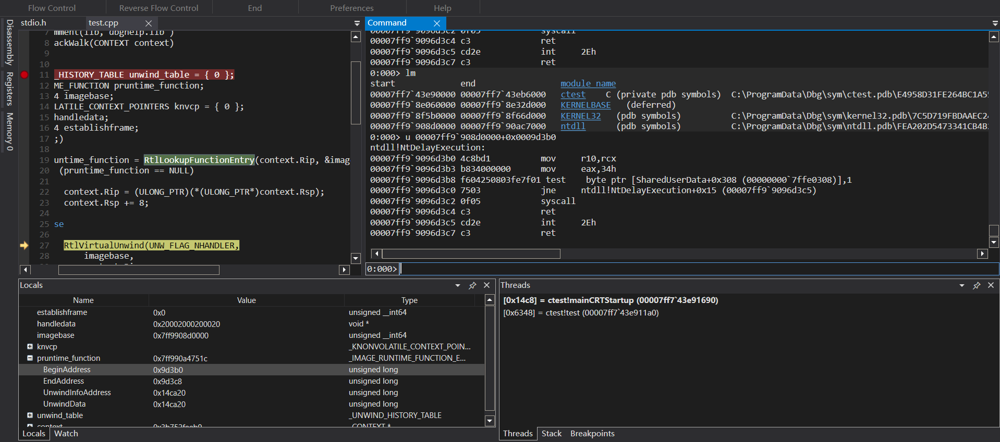

## x86 Call Stack
在x86下，一般函数的调用栈帧的结构大概如下:   

[](x86frame.PNG)  
在管理栈空间中，最主要的两个寄存器分别为EBP以及ESP,EBP表示为当前函数栈的开始，也就是栈底，而ESP则用于提升栈空间，表示为栈顶。
```c++
void add()
{
	printf("test");
}
void test() 
{
	
	int c = 1;
	int b = 2;
	add();
}

```
反汇编上述代码我们大致可以看到类似如下的汇编语句:
```asm
   push ebp
   mov ebp,esp
   sub esp,xxxH
   mov dword ptr [ebp-4h],1
   mov dword ptr [ebp-8h],2
   call add
   add esp,xxxH
   mov esp,ebp
   pop ebp
   ret
```
结合上图不难看出，在x86下，通过EBP可以寻址当前函数体内的局部变量，函数参数，也可以找到函数返回地址，父函数的栈空间，例如：EBP-XXXH 通常表示当前函数内的局部变量，EBP+4 的位置则是返回地址，EBP+8 的位置可能是函数的参数。如此一来，不难看出通过EBP加正数偏移可以引用父函数的地址空间，加负数偏移可以引用当前函数的地址空间。  
进入函数内首先保存了旧的EBP，所以当前EBP所指向的4字节内存单元保存的就是父函数的EBP,同样的可以根据此EBP找到其返回地址等信息，然后依次向上遍历，直到当前线程的最顶层的函数位置，这也就是基本的栈回溯过程。  
### x86 模拟栈回溯
微软提供了API [stackwalk64](https://docs.microsoft.com/en-us/windows/win32/api/dbghelp/nf-dbghelp-stackwalk64) 可以帮我们实现类似的功能.
其内部实现原理可以参考:[StackWalk64栈回溯原理解析](https://bbs.pediy.com/thread-268872.htm)  
借此我们可以实现一个简单的栈回溯过程：
```c++
	CONTEXT context = { 0 };
	context.ContextFlags = CONTEXT_ALL;
	GetThreadContext(thread,&context);
	STACKFRAME64 stackframe = { 0 };
	stackframe.AddrPC.Offset = context.Eip;
	stackframe.AddrPC.Mode = AddrModeFlat;
	stackframe.AddrFrame.Offset = context.Ebp;
	stackframe.AddrFrame.Mode = AddrModeFlat;
	stackframe.AddrStack.Offset = context.Esp;
	stackframe.AddrStack.Mode = AddrModeFlat;
	stackframe.AddrReturn.Offset = context.Eax;
	stackframe.AddrStack.Mode = AddrModeFlat;
	while (true)
	{
		bool res = StackWalk64(IMAGE_FILE_MACHINE_I386,
			GetCurrentProcess(),
			thread,
			&stackframe,
			&context,
			NULL, NULL, NULL, NULL);
		if (!res)
		{
			break;
		}
		printf("ESP:%x ", stackframe.AddrStack.Offset);
		printf("EBP:%x ", stackframe.AddrFrame.Offset);
		printf("RET:%x\n", stackframe.AddrReturn.Offset);
	}
```
### Thread Stack Spoof
这里有两个比较好的项目:https://github.com/mgeeky/ThreadStackSpoofer 以及 https://github.com/countercept/CallStackSpoofer
终端安全防御产品对基于进程以及线程的创建时检测已经不是什么新鲜事了，或者又如一些验证性开源项目：https://github.com/huoji120/DuckMemoryScan
安全防御产品可以检测线程的创建，并对线程做栈回溯，对其所在的内存区域做扫描查杀获取做一些其他的检测

其实可以看到，栈回溯的过程中一旦某个函数栈发生断裂，那么对于该线程的栈回溯就无法完成，所以就可以对如返回地址等影响栈回溯的地方做手脚，干扰检测
x86函数的返回地址一般是EBP + 4的位置，所以我们可以构造一个假的返回地址.  
我们通过RtlCaptureContext捕获线程当前上下文的信息（父函数的寄存器现场），得到EBP从而修改返回地址
```c++
	CONTEXT context = { 0 };
	context.ContextFlags = CONTEXT_ALL;
	RtlCaptureContext(&context);
	ULONG_PTR ret = *(int*)(context.Ebp + 4);  //正确的返回地址
	*(int*)(context.Ebp + 4) = 0;              //修改返回地址
```
我们通过windbg可以看到修改后的效果:  
[](realret.PNG)
[](fakeret.PNG)  
当然直接断开调用栈，程序运行肯定出错，这就需要你适时的恢复正确的调用栈。
## x64 Call Stack  
在x64中，RBP不再充当栈帧（栈底）寄存器，栈顶以及栈底全部经由RSP寄存器充当。
以上述test函数为例，再debug以及release版本中，反汇编大概如下：
```asm
Debug:
        push    rbp
        push    rdi
        sub     rsp,128h
        lea     rbp,[rsp+20h]
        mov     dword ptr [rbp+4],1
        mov     dword ptr [rbp+24h],2
        call    ctest!add
        lea     rsp,[rbp+108h]
        pop     rdi
        pop     rbp
        ret

Release:

        sub     rsp,38h
        mov     dword ptr [rsp+20h],1
        mov     dword ptr [rsp+24h],2
        call    ctest!add
        add     rsp,38h
        ret
```
再debug中RBP只作为了普通的非易失寄存器压栈保留，其中mov dword ptr [rbp+4],1 类似代码看起来像是再通过RBP寻址，其实归根还是通过RSP，rbp只是作为RSP临时开辟堆栈空间后的一个基准，也是便于调试分析，而在release版本中，开启了优化，直接能更清晰的看到通过RSP进行的栈空间访问。

### x64 栈回溯
在学习x64栈回溯之前，需要先了解Runtime_Function,Unwind_Info,Unwind_Code等概念。  
64位的PE结构中多了一个.pdata段，静态存贮异常处理信息的地方，其中有大量的Runtime_Function  
[](pdata.PNG)  

#### Runtime_Function
每个非叶函数都包含一个与之对应的Runtime_Function结构体（叶函数就是不会调用其他函数的函数）  
Runtime_Function结构体构成 [MSDN](https://docs.microsoft.com/en-us/windows/win32/api/winnt/ns-winnt-runtime_function)
```c++
typedef struct _IMAGE_RUNTIME_FUNCTION_ENTRY {
  DWORD BeginAddress;
  DWORD EndAddress;
  union {
    DWORD UnwindInfoAddress;
    DWORD UnwindData;
  } DUMMYUNIONNAME;
} RUNTIME_FUNCTION, *PRUNTIME_FUNCTION, _IMAGE_RUNTIME_FUNCTION_ENTRY, *_PIMAGE_RUNTIME_FUNCTION_ENTRY;
```
其中BeginAddress和EndAddress分别表示函数开始地址与结束地址的RVA,而UnwindInfoAddress则是一个指向Unwind_Info结构体的地址。
我们可以使用windbg查看函数对应的Runtime_Function信息:  
```h
0:001> .fnent ctest!main
Debugger function entry 00000293`c6462c20 for:
Exact matches:
    ctest!main (int, char **)

BeginAddress      = 00000000`000010b0
EndAddress        = 00000000`000010e1
UnwindInfoAddress = 00000000`0001caa8

Unwind info at 00007ff7`b0f1caa8, 6 bytes
  version 1, flags 0, prolog d, codes 1
  00: offs d, unwind op 2, op info 4	UWOP_ALLOC_SMALL.
```
通过BeginAddress我们可以得到main函数的起始地址:
```h
0:001> lm
start             end                 module name
00007ff7`b0f00000 00007ff7`b0f26000   ctest    C (private pdb symbols)  
00007ff9`8e060000 00007ff9`8e32d000   KERNELBASE   (deferred)             
00007ff9`8f5b0000 00007ff9`8f66d000   KERNEL32   (pdb symbols)         
00007ff9`908d0000 00007ff9`90ac7000   ntdll      (pdb symbols)          
0:001> ?00007ff7`b0f00000+00000000`000010b0
Evaluate expression: 140701802172592 = 00007ff7`b0f010b0
0:001> u 00007ff7`b0f010b0
ctest!main:
00007ff7`b0f010b0 4889542410      mov     qword ptr [rsp+10h],rdx
00007ff7`b0f010b5 894c2408        mov     dword ptr [rsp+8],ecx
00007ff7`b0f010b9 4883ec28        sub     rsp,28h
00007ff7`b0f010bd e86effffff      call    ctest!test (00007ff7`b0f01030)
```
#### Unwind_Info
而Unwind_Info则相对要复杂一些 [MSDN](https://docs.microsoft.com/en-us/cpp/build/exception-handling-x64?view=msvc-170)
```c++
typedef union _UNWIND_CODE {
    struct {
        UBYTE Offset;
        UBYTE UnwindOp :4
        UBYTE OpInfo   :4
    };
    USHORT FrameOffset;
} UNWIND_CODE, *PUNWIND_CODE;

typedef struct _UNWIND_INFO {
    UBYTE Version       :3
    UBYTE Flags         :5
    UBYTE SizeOfProlog;
    UBYTE CountOfCodes;
    UBYTE FrameRegister :4
    UBYTE FrameOffset   :4
    UNWIND_CODE UnwindCode[1];
} UNWIND_INFO, *PUNWIND_INFO;
```
比较关键的字段flags代表的意义如下：
* UNW_FLAG_NHANDLER 0x0  不处理异常，或者没有异常处理函数都为此值
* UNW_FLAG_EHANDLER 0x01 当寻找需要检查异常的函数时, 函数需要调用该异常处理程序，也就是通过except进行处理。
* UNW_FLAG_UHANDLER 0x02 当展开一个异常时，函数应调用该终止处理程序，也就是通过finally函数处理。
* UNW_FLAG_CHAININFO 0x04 使用调用链，具体可以看MSDN。

然后是prolog字段，详细可以看 [MSDN](https://docs.microsoft.com/en-us/cpp/build/prolog-and-epilog?view=msvc-170&viewFallbackFrom=vs-2019)
简单来说，调用其他函数、或使用异常处理的指令之前的代码就是prolog，做一些保存非易失寄存器，为局部变量分配临时的空间等操作，它的大小为从函数起始地址算起，这里的prolog字段代表了prolog大小为0XD也就是13个字节。  
[](prolog.PNG)  
然后是codes（Count of unwind codes）代表unwind_code的个数。我们这里是1，代表只有一个unwind_code。  
接下里UNWIND_CODE，UNWIND_CODE中的信息包含了非易失寄存器的数量，以及栈上的局部变量和参数信息，可以理解为通过UNWIND_CODE，你可以知道，当前函数内，对栈做的操作，从而知道对栈改变的具体大小，常见的unwind_code：
* UWOP_PUSH_NONVOL(0) 将非易失寄存器压栈（push RBX）
* UWOP_SAVE_NONVOL(4) 将非易失寄存器保存在栈上(mov qword ptr [RSP+XXH],RBX)
* UWOP_ALLOC_LARGE(1) 在栈上分配大空间，最大为4GB
* UWOP_ALLOC_SMALL(2) 在栈上分配小空间，8~123 bytes

在windbg中我们可以看到unwind op 2, op info 4,做了UWOP_ALLOC_SMALL操作，分配大小为op info field * 8 + 8，也就是40=28H，对应我们的sub rsp,28h，op info的意义对应于不同的unwind op，具体可看前面的MSDN文档。  
而在IDA中，找到对应的unwind_info信息:  
[](unwindinfo.PNG) 
对应与前面的结构体42h=0100 0010 ->4 2,unwind op 2, op info 4。IDA也标记为UWOP_ALLOC_SMALL  
接下来，我们构造一个简单的除0异常：
```c++
	__try 
	{
		int a = 0;
		int b = a / a;
	}
	__except(1) 
	{
		printf("Error\n");
	}
```
[](unwindinfo2.PNG) 
此时UNWIND_INFO变成了9 0000 1001-> version 1,flags->1,此时需要异常处理函数处理  
dd rva __C_specific_handler 这一行就是__C_specific_handler函数的rva值，关于此函数 [__C_specific_handler]([__C_specific_handler](https://docs.microsoft.com/en-us/windows/win32/devnotes/--c-specific-handler2))  
接下来是一个C_SCOPE_TABLE的一个结构体  
```c++
typedef struct _SCOPE_TABLE {
 ULONG Count;
 struct
 {
     ULONG BeginAddress;
     ULONG EndAddress;
     ULONG HandlerAddress;
     ULONG JumpTarget;
 } ScopeRecord[1];
} SCOPE_TABLE, *PSCOPE_TABLE;
```
IDA中的4个RVA分别对应以上的4个字段，其中BeginAddress以及EndAddress表示了try代码块的范围
[](try.PNG)  
HandlerAddress则表示了except_filter函数RVA，JumpTarget则表示except异常处理函数RVA,我这里filter用1表示使用当前except异常处理函数处理，编译器自动生成了一个filter函数体。  
[](filter.PNG)

### 回溯调用栈
根据对RUNTIME_FUNCTION以及UNWIND_INFO的分析，我们可以得到每个函数的栈帧的空间，也就是得到子函数的RSP我们就可以推算出父函数的堆栈空间。  
例如windbg如下的调用栈:
```h
0:000> knf
 #   Memory  Child-SP          RetAddr               Call Site
00           000000b7`4b16fca8 00007ff7`25611009     ctest!sub
01         8 000000b7`4b16fcb0 00007ff7`25611049     ctest!add+0x9  
02        30 000000b7`4b16fce0 00007ff7`256110c2     ctest!test+0x19  
03        40 000000b7`4b16fd20 00007ff7`25611400     ctest!main+0x12  
04        30 (Inline Function) --------`--------     ctest!invoke_main+0x22 
...........
```
Child-SP表示子函数初始化完成后的RSP状态值，例如这里add函数调用sub，会有sub RSP,xxxH,CALL SUB这个过程，Child-SP就表示Call之前的RSP，也就是当前函数的初始RSP。（任何还未展开的函数，在windbg中memory显示为空，下一行的8因为压入了返回值占用8个字节）    
这里add函数RSP为000000b7`4b16fcb0，根据X64函数的栈帧结构，栈帧的大小=返回地址（8 个字节）+不可变寄存器+局部变量+基于栈的参数+基于寄存
器的参数（shadow space->0x20h个字节）= 返回地址（8个字节）+ unwind_code得出堆栈空间改变大小。  
add函数的Unwind信息如下：
```h
0:000> .fnent ctest!add
Debugger function entry 00000196`75b733c0 for:
Exact matches:
    ctest!add (void)

BeginAddress      = 00000000`00001000
EndAddress        = 00000000`0000100e
UnwindInfoAddress = 00000000`0001ca98

Unwind info at 00007ff7`2562ca98, 6 bytes
  version 1, flags 0, prolog 4, codes 1
  00: offs 4, unwind op 2, op info 4	UWOP_ALLOC_SMALL.
```
所以栈帧大小为8+(4*8+8)=0x30h,所以其父函数的RSP=000000b7~4b16fcb0+0x30 = 000000b7~4b16fce0,Windbg中当前函数栈帧的大小位于下一行的Memory中。
而返回地址怎么算呢，以add函数的反汇编为例：
```asm
0:000> u ctest!add
00007ff7`25611000 4883ec28        sub     rsp,28h
00007ff7`25611004 e807000000      call    ctest!sub (00007ff7`25611010)
00007ff7`25611009 4883c428        add     rsp,28h
00007ff7`2561100d c3              ret
```
sub rsp,28h后即child-sp,因为调用call之后，会 push ret地址，所以返回地址就在child-sp+unwind_code得出堆栈空间改变大小的地址处  
```h
0:000> .fnent ctest!add
Debugger function entry 00000196`75b733c0 for:
Exact matches:
    ctest!add (void)

BeginAddress      = 00000000`00001000
EndAddress        = 00000000`0000100e
UnwindInfoAddress = 00000000`0001ca98

Unwind info at 00007ff7`2562ca98, 6 bytes
  version 1, flags 0, prolog 4, codes 1
  00: offs 4, unwind op 2, op info 4	UWOP_ALLOC_SMALL.
0:000> dq 000000b7`4b16fcb0+(4*8+8)
000000b7`4b16fcd8  00007ff7`25611049 00000000`00000002
000000b7`4b16fce8  00007ff7`256112e6 00007ff7`25624280
000000b7`4b16fcf8  00000000`00000001 00000002`00000001
000000b7`4b16fd08  bfebfbff`7ffafbbf 00007ff7`256242c0
000000b7`4b16fd18  00007ff7`256110c2 00000000`0000001f
000000b7`4b16fd28  00000000`00000000 00000000`00000000
000000b7`4b16fd38  00007ff7`256242c8 00000000`00000000
000000b7`4b16fd48  00007ff7`25611400 00000000`00000001


0:000> .fnent ctest!test
Debugger function entry 00000196`75b733c0 for:
Exact matches:
    ctest!test (void)

BeginAddress      = 00000000`00001030
EndAddress        = 00000000`0000104e
UnwindInfoAddress = 00000000`0001caa0

Unwind info at 00007ff7`2562caa0, 6 bytes
  version 1, flags 0, prolog 4, codes 1
  00: offs 4, unwind op 2, op info 6	UWOP_ALLOC_SMALL.
0:000> dq 000000b7`4b16fce0+(6*8+8)
000000b7`4b16fd18  00007ff7`256110c2 00000000`0000001f
000000b7`4b16fd28  00000000`00000000 00000000`00000000
000000b7`4b16fd38  00007ff7`256242c8 00000000`00000000
000000b7`4b16fd48  00007ff7`25611400 00000000`00000001
000000b7`4b16fd58  000001d6`11763150 00000000`00000000
000000b7`4b16fd68  00000000`00000000 00000000`00000000
000000b7`4b16fd78  00000000`00000000 00000000`00000000
000000b7`4b16fd88  00007ff9`8f5c7034 00000000`00000000
```
计算得到的结果和Windbg得到的一致。
### 代码模拟x64栈回溯
我们可以根据上面的那些结构体信息来模拟栈回溯了，同样的Windows提供了对应的API来利用这些信息完成栈回溯。  
[RtlLookupFunctionEntry](https://docs.microsoft.com/en-us/windows/win32/api/winnt/nf-winnt-rtllookupfunctionentry)  
```c++
NTSYSAPI PRUNTIME_FUNCTION RtlLookupFunctionEntry(
  [in]  DWORD64               ControlPc,
  [out] PDWORD64              ImageBase,
  [out] PUNWIND_HISTORY_TABLE HistoryTable
);
```
[RtlVirtualUnwind](https://docs.microsoft.com/en-us/windows/win32/api/winnt/nf-winnt-rtlvirtualunwind)
```c++
NTSYSAPI PEXCEPTION_ROUTINE RtlVirtualUnwind(
  [in]                DWORD                          HandlerType,
  [in]                DWORD64                        ImageBase,
  [in]                DWORD64                        ControlPc,
  [in]                PRUNTIME_FUNCTION              FunctionEntry,
  [in, out]           PCONTEXT                       ContextRecord,
  [out]               PVOID                          *HandlerData,
  [out]               PDWORD64                       EstablisherFrame,
  [in, out, optional] PKNONVOLATILE_CONTEXT_POINTERS ContextPointers
);

```
简单的示例代码：
```c++
#include <Windows.h>
#include <stdio.h>
#include <iostream>
#include <TlHelp32.h>
#include <winnt.h>
#include <dbghelp.h>
#pragma comment(lib,"dbghelp.lib")

void my_StackWalk(CONTEXT context) 
{

	UNWIND_HISTORY_TABLE unwind_table = { 0 };
	PRUNTIME_FUNCTION pruntime_function;
	DWORD64 imagebase;
	KNONVOLATILE_CONTEXT_POINTERS knvcp = { 0 };
	PVOID handledata;
	DWORD64 establishframe;
	for (;;)
	{
		pruntime_function = RtlLookupFunctionEntry(context.Rip, &imagebase, &unwind_table);

		RtlVirtualUnwind(UNW_FLAG_NHANDLER,
				imagebase,
				context.Rip,
				pruntime_function,
				&context,
				&handledata,
				&establishframe,
				&knvcp);
		
		if (!context.Rip)
		{
			break;
		}
		printf("RSP:%llx ", establishframe);
		printf("RIP:%llx\n", context.Rip);
	}
}

void sub()
{

	Sleep(INFINITE);
}

void add()
{
	sub();
}
void test() 
{
	
	int c = 1;
	int b = 2;
	add();
}
int main(int argc, char** argv)
{

	HANDLE thread = CreateThread(NULL, 0, (LPTHREAD_START_ROUTINE)test, NULL, 0, NULL);
	WaitForSingleObject(thread, 1000);
	CONTEXT context = { 0 };
	context.ContextFlags = CONTEXT_ALL;
	GetThreadContext(thread,&context);
	my_StackWalk(context);
	system("pause");
}

```
我们创建一个线程运行我们需要进行做回溯的代码，待线程启动后我们使用GetThreadContext获取线程的有效上下文，此时的捕获到的上下文处于Sleep底层函数ntdll!NtDelayExecution从内核返回用户层的那一刻，可以通过windbg调试查看对应的上下文信息。RtlLookupFunctionEntry获取对应函数的RUNTIME_FUNCTION信息。  

[](ntruntimefunction.PNG) 
我们得到了子函数的堆栈信息就可以开始进行回溯了，通过RtlVirtualUnwind API就可以完成这个过程。  
RtlVirtualUnwind是如何做模拟展开的呢，其实也是解析unwind_info信息，做一些反向回滚之类的操作。  
windbg调用栈信息:
```h
0:001> knf
 #   Memory  Child-SP          RetAddr               Call Site
00           0000003b`753ff9c8 00007ff9`8e0a96de     ntdll!NtDelayExecution+0x14
01         8 0000003b`753ff9d0 00007ff7`43e9118f     KERNELBASE!SleepEx+0x9e
02        a0 0000003b`753ffa70 00007ff7`43e91009     ctest!sub+0xf  
03        30 0000003b`753ffaa0 00007ff7`43e911b9     ctest!add+0x9  
04        30 0000003b`753ffad0 00007ff9`8f5c7034     ctest!test+0x19 
05        40 0000003b`753ffb10 00007ff9`90922651     KERNEL32!BaseThreadInitThunk+0x14
06        30 0000003b`753ffb40 00000000`00000000     ntdll!RtlUserThreadStart+0x21
```
```h
0:000> .fnent KERNELBASE!SleepEx
Debugger function entry 00000224`be808480 for:
(00007ff9`8e0a9640)   KERNELBASE!SleepEx   |  (00007ff9`8e0a9780)   KERNELBASE!FlsSetValue
Exact matches:
    KERNELBASE!SleepEx (void)

BeginAddress      = 00000000`00049640
EndAddress        = 00000000`00049777
UnwindInfoAddress = 00000000`0026d2f8

Unwind info at 00007ff9`8e2cd2f8, 14 bytes
  version 1, flags 2, prolog e, codes 4
  handler routine: KERNELBASE!_C_specific_handler (00007ff9`8e0eea35), data 1
  00: offs e, unwind op 2, op info f	UWOP_ALLOC_SMALL.
  01: offs 7, unwind op 0, op info 7	UWOP_PUSH_NONVOL reg: rdi.
  02: offs 6, unwind op 0, op info 6	UWOP_PUSH_NONVOL reg: rsi.
  03: offs 5, unwind op 0, op info 3	UWOP_PUSH_NONVOL reg: rbx.
0:000> u KERNELBASE!SleepEx
KERNELBASE!SleepEx:
00007ff9`8e0a9640 89542410        mov     dword ptr [rsp+10h],edx
00007ff9`8e0a9644 53              push    rbx
00007ff9`8e0a9645 56              push    rsi
00007ff9`8e0a9646 57              push    rdi
00007ff9`8e0a9647 4881ec80000000  sub     rsp,80h
00007ff9`8e0a964e 8bda            mov     ebx,edx
00007ff9`8e0a9650 8bf9            mov     edi,ecx
00007ff9`8e0a9652 48c744243048000000 mov   qword ptr [rsp+30h],48h
```
通过RtlVirtualUnwind对KERNELBASE!SleepEx做展开，获取到的Child-SP 0x0000003b753ff9d0,而context中还有一个RSP的值为0x0000003b753ffa70
这个值怎能了来的呢，如果你理解了之前的知识，很明显根据unwind_info中的信息得到的:
```
0x0000003b753ff9d0+(f*8+8)+8*3+8 = 0x0000003b753ffa70
```
而这个RSP则是函数sub函数的Child-SP,RtlVirtualUnwind就是这样一层一层往上滚，直到顶层为止。  
  
  
  

Reference  

https://codemachine.com/articles/x64_deep_dive.html  
https://boxcounter.com/posts/2011-11-04-seh-x64/  
https://www.anquanke.com/post/id/247688#h3-10  
https://docs.microsoft.com/en-us/windows/win32/api/winnt/nf-winnt-rtllookupfunctionentry  
https://docs.microsoft.com/en-us/windows/win32/api/winnt/nf-winnt-rtlvirtualunwind  
https://docs.microsoft.com/en-us/cpp/build/prolog-and-epilog?view=msvc-170&viewFallbackFrom=vs-2019  
https://docs.microsoft.com/en-us/cpp/build/exception-handling-x64?view=msvc-170